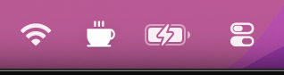
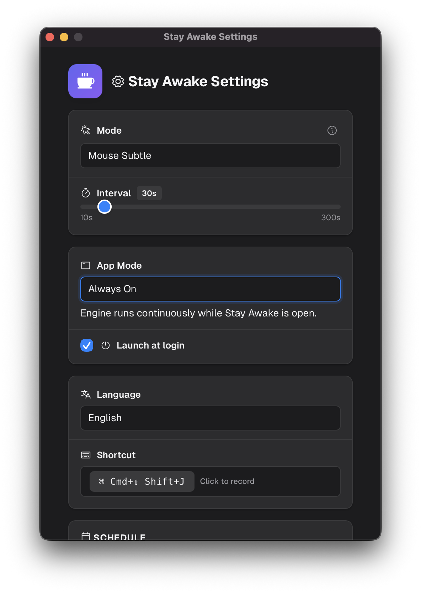
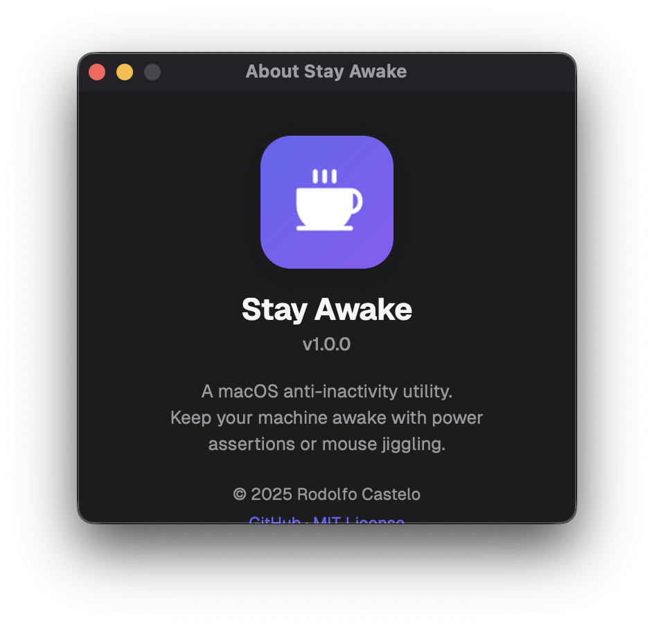

# Stay Awake

> Keep your macOS awake and active — no sleep, no idle, no interruptions.

  

Stay Awake is a macOS-only tray utility that prevents your computer from sleeping. It lives in the menu bar and stays out of your way — configure it once and forget it. Built with Rust and Tauri v2.

## Screenshots

### Menu bar


### Settings


### About


## Features

- **Power Only** — prevents sleep via macOS IOKit power assertions; no mouse movement, no Accessibility permission required
- **Mouse Subtle** — moves the cursor 1 px right and back; barely perceptible
- **Mouse Zen** — fires a zero-delta mouse event that resets the idle timer with no visible movement
- **Mouse Circle** — traces a small square pattern (right, down, left, up; 1 pixel per step)
- **WiFi mode** — automatically activates the engine when you join a registered network and stops it when you disconnect (App Mode; reads SSID locally, never toggles your WiFi)
- **Scheduling** — set start/end times and active days (Mon–Sun); supports overnight spans (e.g. 22:00–06:00)
- **Profiles** — save and load named settings profiles for different use cases
- **Global hotkey** — toggle active/inactive from anywhere (default: `⌘+Shift+J`, customizable)
- **Idle detection** — skips jiggle automatically when you are actively using the mouse
- **Launch at Login** — configurable autostart via macOS LaunchAgent
- **Auto-updater** — checks for new versions on launch; prompts to install when a release is available
- **Internationalization** — available in English, Spanish, French, German, Portuguese (BR), Japanese, Chinese (Simplified), and Korean

## Installation

### Homebrew (recommended)

```sh
brew install shoootyou/tap/stay-awake
```

### Manual download

Download the latest `.dmg` from the [GitHub Releases](https://github.com/shoootyou/stay-awake/releases) page, open it, and drag **Stay Awake** to your Applications folder.

## Updates

**Homebrew** — run `brew upgrade shoootyou/tap/stay-awake`.

**Manual DMG install** — Stay Awake checks for new versions on launch. When an update is available on [GitHub Releases](https://github.com/shoootyou/stay-awake/releases), a prompt appears in the menu bar letting you install it in one click.

## System Requirements

- macOS 12 Monterey or later
- Apple Silicon (native) or Intel (via Rosetta 2)

## Development

### Prerequisites

- Rust (stable) — install via [rustup](https://rustup.rs)
- Node.js 22+
- Tauri CLI — `cargo install tauri-cli`

### Setup

```sh
npm install
npm run tauri dev
```

### Build

```sh
npm run tauri build
```

## Sponsor

If Stay Awake saves you from one more accidental sleep during a video call, consider [sponsoring the project on GitHub](https://github.com/sponsors/shoootyou). Every contribution helps keep development going.

## License

[MIT](LICENSE) © Rodolfo Castelo
