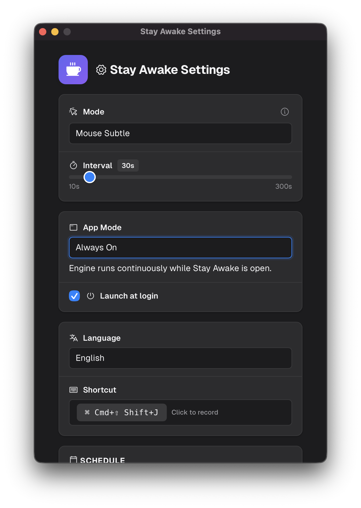
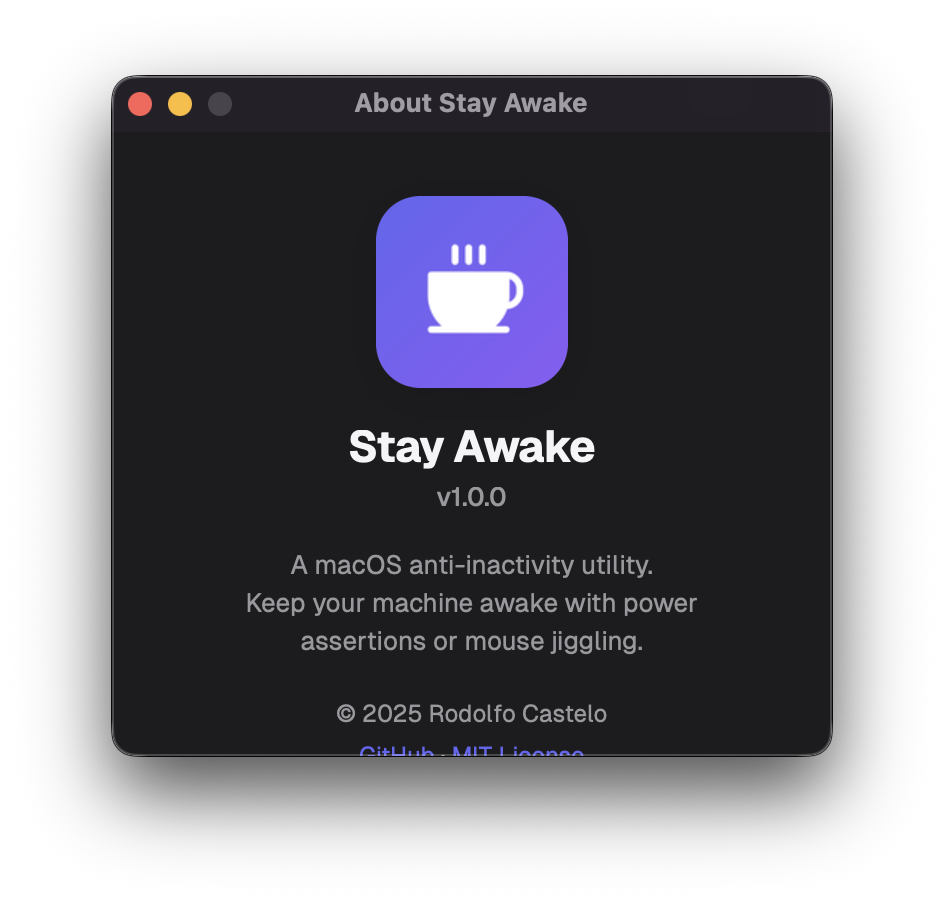

# Stay Awake

> Keep your computer awake and active — no sleep, no idle, no interruptions.

   

Stay Awake is a tray utility that prevents your computer from sleeping, for macOS and Linux. It lives in the menu bar / system tray and stays out of your way — configure it once and forget it. Built with Rust and Tauri v2.

## Screenshots

### Menu bar


### Settings


### About


## Features

- **Power Only** — prevents sleep via macOS IOKit power assertions; no mouse movement, no Accessibility permission required
- **Mouse Subtle** — moves the cursor 1 px right and back; barely perceptible
- **Mouse Zen** — fires a zero-delta mouse event that resets the idle timer with no visible movement
- **Mouse Circle** — traces a small square pattern (right, down, left, up; 1 pixel per step)
- **WiFi mode** — automatically activates the engine when you join a registered network and stops it when you disconnect (App Mode; reads SSID locally, never toggles your WiFi)
- **Scheduling** — set start/end times and active days (Mon–Sun); supports overnight spans (e.g. 22:00–06:00)
- **Profiles** — save and load named settings profiles for different use cases
- **Global hotkey** — toggle active/inactive from anywhere (default: `⌘+Shift+J`, customizable)
- **Idle detection** — skips jiggle automatically when you are actively using the mouse
- **Launch at Login** — configurable autostart via macOS LaunchAgent
- **Auto-updater** — checks for new versions on launch; prompts to install when a release is available
- **Internationalization** — available in English, Spanish, French, German, Portuguese (BR), Japanese, Chinese (Simplified), and Korean

## Installation

### Homebrew (macOS, recommended)

```sh
brew install shoootyou/tap/stay-awake
```

### Manual download

**macOS** — Download the latest `.dmg` from the [GitHub Releases](https://github.com/shoootyou/stay-awake/releases) page, open it, and drag **Stay Awake** to your Applications folder.

**Linux** — Download the latest `.deb` from the [GitHub Releases](https://github.com/shoootyou/stay-awake/releases) page and install it:

```sh
sudo apt install ./stay-awake_<version>_amd64.deb
```

### Linux prerequisites

- **NetworkManager** — required for WiFi mode (auto-activate on a registered network). Other modes work without it.
- **`xdotool`** (recommended, not required) — needed for the mouse-jiggle modes (Subtle, Zen, Circle). `Power Only` mode works without it. The `.deb` package declares `xdotool` as a `Recommends`, so it installs automatically via `apt` unless you opt out with `--no-install-recommends`.

**Why `Power Only` is the default jiggle mode on Linux:** the mouse-jiggle modes rely on
`xdotool` injecting absolute mouse motion to reset the desktop's idle timer. Whether this
actually resets GNOME/Mutter's idle timer under Wayland was never conclusively measured during
implementation — the measurement attempt was run in a sandboxed environment that could not
reliably reach the session D-Bus/systemd-user-session tooling required, so the result is
genuinely inconclusive rather than a confirmed failure. Per this project's precautionary
policy, an inconclusive reset measurement is treated the same as a negative one for choosing a
default, so `Power Only` (which uses `systemd-inhibit` and is verified working) ships as the
Linux default instead of `MouseSubtle`. If you're on X11 and have confirmed mouse-jiggle works
for your setup, you can still opt into `Mouse Subtle` / `Mouse Circle` / `Mouse Zen` manually
via Settings. A future re-test on real (non-sandboxed) Wayland hardware may confirm the reset
behavior and justify changing this default back — contributions measuring this are welcome.

## Updates

**Homebrew (macOS)** — run `brew upgrade shoootyou/tap/stay-awake`.

**Manual DMG install (macOS)** — Stay Awake checks for new versions on launch. When an update is available on [GitHub Releases](https://github.com/shoootyou/stay-awake/releases), a prompt appears in the menu bar letting you install it in one click.

**Linux (.deb)** — updates are delivered via APT, not the in-app updater. Download the new `.deb` from [GitHub Releases](https://github.com/shoootyou/stay-awake/releases) and reinstall with `sudo apt install ./stay-awake_<version>_amd64.deb`.

## System Requirements

**macOS**
- macOS 12 Monterey or later
- Apple Silicon (native) or Intel (via Rosetta 2)

**Linux**
- A `systemd`-based distribution (Debian/Ubuntu and derivatives, via the `.deb` package)
- NetworkManager (for WiFi mode)
- `xdotool` (recommended, for mouse-jiggle modes)

## Development

### Prerequisites

- Rust (stable) — install via [rustup](https://rustup.rs)
- Node.js 22+
- Tauri CLI — `cargo install tauri-cli`
- **Linux only** — system libraries required to build Tauri's GTK/WebKit stack:
  ```sh
  sudo apt-get install -y libgtk-3-dev libwebkit2gtk-4.1-dev libayatana-appindicator3-dev librsvg2-dev patchelf
  ```

### Setup

```sh
npm install
npm run tauri dev
```

### Build

```sh
npm run tauri build
```

## Sponsor

If Stay Awake saves you from one more accidental sleep during a video call, consider [sponsoring the project on GitHub](https://github.com/sponsors/shoootyou). Every contribution helps keep development going.

## License

[MIT](LICENSE) © Rodolfo Castelo
